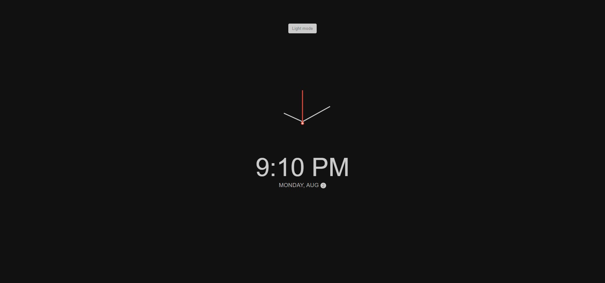

# Theme Clock
Project #19 in Brad Traversy's 50 Projects in 50 Days. This project is a clock. The hour, minute and seconds hands are styled with CSS. JS is used to power it and show the current time, in both analog and digital display, as well as date, and toggled between light and dark mode. 



## Built With
- [HTML5](https://developer.mozilla.org/en-US/docs/Web/Guide/HTML/HTML5)
- [CSS3](https://developer.mozilla.org/en-US/docs/Web/CSS)
- [Javascript](https://developer.mozilla.org/en-US/docs/Web/JavaScript)

## Install
```
    $ git clone git@github.com:samiiexx/sam-js-19.git
    $ cd main
```  
## Contributors
- Favour Samuel (@samiiexx)

## License
Copyright (c) 2021 Favour Samuel.

For enquiries please contact me at [sfchidimma@gmail.com](mailto:sfchidimma@gmail.com).